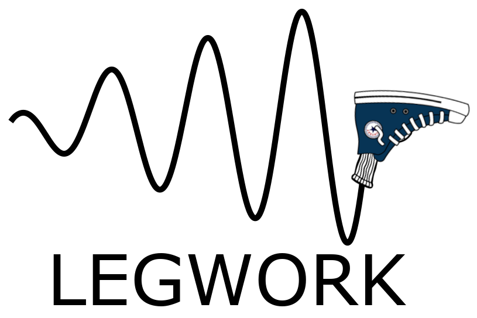

.. legwork documentation master file, created by
   sphinx-quickstart on Mon Feb  8 22:30:58 2021.
   You can adapt this file completely to your liking, but it should at least
   contain the root `toctree` directive.

**LEGWORK** (**L**\ ISA **E**\ volution and **G**\ ravitational **W**\ ave **OR**\ bit **K**\ it) is a python package designed to calculate signal to noise ratios for GWs emitted from inspiraling binary systems that are potentially observable by LISA. 

LEGWORK also contains a plotting module show you can show off those detectable GW sources of yours and treats any and all kinds of inspiralling binaries. 
Circular and stationary? No problem!
Eccentric and chirping? We've got you covered!

Want to determine if *your* favorite source is detectable by LISA? Let LEGWORK do the legwork and keep the LISA literature free from spurious factors of 2!

.. toctree::
   :maxdepth: 1

    Installation <install>
    Tutorials <tutorials>
    GitHub <https://github.com/katiebreivik/LEGWORK>
    Submit an issue <https://github.com/katiebreivik/LEGWORK/issues>
    Modules <modules>

Indices
=======

* :ref:`genindex`
* :ref:`modindex`
* :ref:`search`
